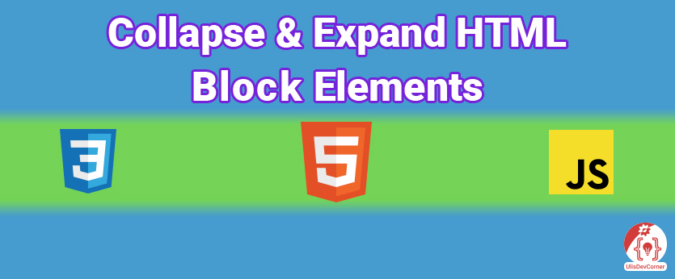  
Welcome, this is the repo of my video on my YouTube channel **Collapse & Expand HTML Block Elements**.  
You can find this video and more on my YouTube channel [UlisDevCorner](https://www.youtube.com/channel/UCaBQyc2U5kP_NUwrgmXQcFw).

### Starter on GitHub
[Webpack 5 SASS - Starter](https://github.com/UlisDevCorner-Starters/webpack-5-sass)

## Emmet
**Emmet — the essential toolkit for web-developers**  
Emmet is a plugin for many popular text editors which greatly improves HTML & CSS workflow.

[Emmet](https://emmet.io/)

## Used Emmet Abbreviations
### HTML
|     Emmet      |                              HTML                              |
|:--------------:|:--------------------------------------------------------------:|
|       !        |                       HTML5 Boilerplate                        |
|   p>lorem100   |          Create p Tag `
100 Lorem Ipsum Words
`           |
|       .        |      Create div Tag with CSS Class `

`      |
|  .class-name   | Create div Tag with CSS Class `

` |
|       #        |           Create div Tag with ID `

`           |
|       h1       |                   Create h1 Tag `<h1></h1>`                    |
| h1{Some Title} |              Create h1 Tag  `<h1>Some Title</h1>`              |

### CSS
|  Emmet  |           CSS            |
|:-------:|:------------------------:|
| maw960  |    max-width: 960px;     |
|   m:a   |      margin: auto;       |
|   lh    |      line-height: ;      |
|  cur:p  |     cursor: pointer;     |
|  fl:r   |      float: right;       |
|  mt-48  |    margin-top: -48px;    |
|   trs   |  transition: prop time;  |
|   cnt   |       content: "";       |
| trf:rx  |  transform: rotateX();   |
| trf:rz  |  transform: rotateZ();   |
|   fz    |     font-size: 32px;     |
|  fs:n   |   font-style: normal;    |
|   bgi   | background-image: url(); |
| bgsz:cv | background-size: cover;  |
|   w32   |       width: 32px;       |
|   h10   |      height: 10ox;       |
|  ov:h   |    overflow: hidden;     |

[Emmet: Cheat Sheet](https://docs.emmet.io/cheat-sheet/)

### Lorem Ipsum
**Lorem Ipsum** is simply dummy text of the printing and typesetting industry.

[**Web**: Lorem Ipsum](https://www.lipsum.com/)

### HTML Symbols, Entities and ASCII Character Codes
A delightful reference for HTML Symbols, Entities and ASCII Character Codes  

[WEB: Toptal](https://www.toptal.com/designers/htmlarrows/#)

### Icon I use
[HEAVY LEFT-POINTING ANGLE BRACKET ORNAMENT](https://www.toptal.com/designers/htmlarrows/symbols/heavy-left-pointing-angle-bracket-ornament/)

### .GitIgnore
[**Toptal**: .gitignore](https://www.toptal.com/developers/gitignore)

[**YouTube**: Webpack 5 with SASS - Part 1, The Development Configuration](https://www.youtube.com/watch?v=dvS3IIkds4Q)

### SVG ICON form SVG Repo
[Chevron Icon](https://www.svgrepo.com/svg/267441/chevron)

## Geometry of the chevron icon in space
The chevron on the z-axis of 0 degree.  
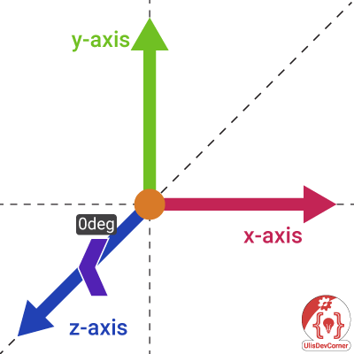

The chevron on the z-axis of 90 degree. That's what we need.   
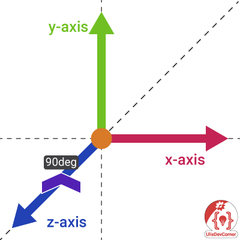

The chevron on the z-axis of 270 degree.  
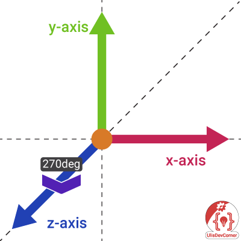

The chevron on the x, y-axis of 0, and z-axis of 90 degree.  
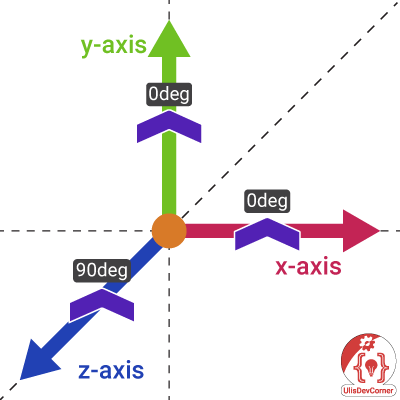

Now I move the chevron to the x-axis to explain what's going on.  
The chevron on the z-axis of 90 degree, and x-axis of 0 degree.  
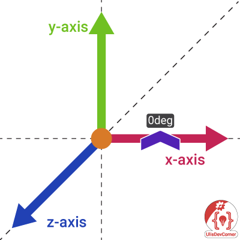

The chevron on the z-axis of 90 degree, and x-axis of 45 degree.   
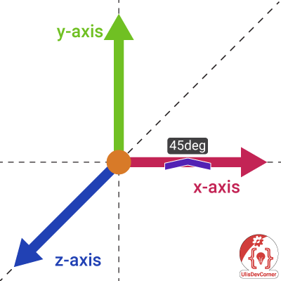

The chevron on the z-axis of 90 degree, and x-axis of 90 degree.   
Here we can see just a line because it's a 2d geometry,  
and of course it will basically disappear.  
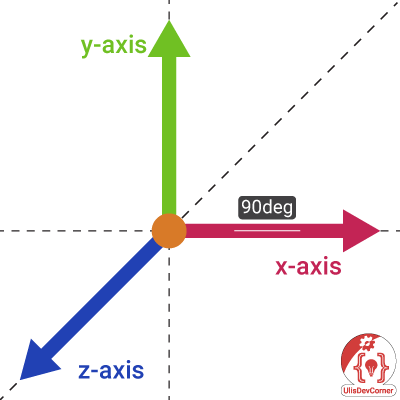

The chevron on the z-axis of 90 degree, and x-axis of 135 degree.  

The chevron on the z-axis of 90 degree, and x-axis of 180 degree.  
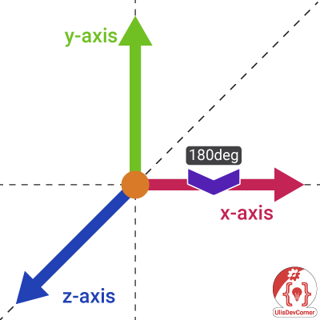

The chevron on the z-axis of 90 degree, and y-axis of 0 degree.  
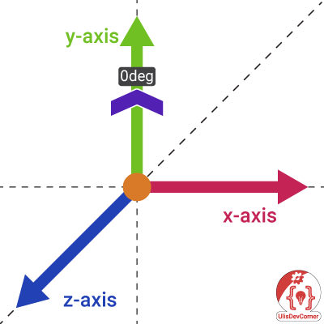

The chevron on the z-axis of 90 degree, and y-axis of 45 degree.  
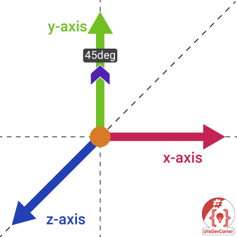

And when we use on the y-axis 180 degree we're there where we started with 0 degree.

## Useful Links

### HTML

[**MDN**: HTML Basics](https://developer.mozilla.org/en-US/docs/Learn/Getting_started_with_the_web/HTML_basics)

[**MDN**: _h1–h6_: The HTML Section Heading elements](https://developer.mozilla.org/en-US/docs/Web/HTML/Element/Heading_Elements)

[**MDN**: _div_: The Content Division element](https://developer.mozilla.org/en-US/docs/Web/HTML/Element/div)

[**MDN**: _p_: The Paragraph element](https://developer.mozilla.org/en-US/docs/Web/HTML/Element/p)

[**MDN**: _i_: The Idiomatic Text element](https://developer.mozilla.org/en-US/docs/Web/HTML/Element/i)

### CSS

[**MDN**: CSS basics](https://developer.mozilla.org/en-US/docs/Learn/Getting_started_with_the_web/CSS_basics)

[**MDN**: cursor](https://developer.mozilla.org/en-US/docs/Web/CSS/cursor)

[**MDN**: ::after](https://developer.mozilla.org/en-US/docs/Web/CSS/::after)

[**MDN**: transform](https://developer.mozilla.org/en-US/docs/Web/CSS/transform)

[**MDN**: Rotate X](https://developer.mozilla.org/en-US/docs/Web/CSS/transform-function/rotateX)

[**MDN**: Rotate Z](https://developer.mozilla.org/en-US/docs/Web/CSS/transform-function/rotateZ)

[**MDN**: CSS generated content](https://developer.mozilla.org/en-US/docs/Learn/CSS/Howto/Generated_content)

[**MDN**: Background Image](https://developer.mozilla.org/en-US/docs/Web/CSS/background-image)

[**MDN**: Background Size](https://developer.mozilla.org/en-US/docs/Web/CSS/background-size)

[**MDN**: URL](https://developer.mozilla.org/en-US/docs/Web/CSS/url)

[**MDN**: CSS transitions](https://developer.mozilla.org/en-US/docs/Web/CSS/CSS_Transitions/Using_CSS_transitions)

[**MDN**: Overflow](https://developer.mozilla.org/en-US/docs/Web/CSS/overflow)

### SASS

[**SASS Lang**: SASS Basics](https://sass-lang.com/guide)

[**SASS Lang**: Nesting](https://sass-lang.com/guide#topic-3)

[**SASS Lang**: Partials](https://sass-lang.com/guide#topic-4)

### JavaScript

[**MDN**: JavaScript Basics](https://developer.mozilla.org/en-US/docs/Learn/Getting_started_with_the_web/JavaScript_basics)

[**MDN**: Export](https://developer.mozilla.org/en-US/docs/Web/JavaScript/Reference/Statements/export)

[**MDN**: Classes](https://developer.mozilla.org/en-US/docs/Web/JavaScript/Reference/Classes)

[**MDN**: Private Class Features](https://developer.mozilla.org/en-US/docs/Web/JavaScript/Reference/Classes/Private_class_fields)

[**MDN**: querySelectorAll](https://developer.mozilla.org/en-US/docs/Web/API/Document/querySelectorAll)

[**MDN**: Constructor](https://developer.mozilla.org/en-US/docs/Web/JavaScript/Reference/Classes/constructor)

[**MDN**: onload](https://developer.mozilla.org/en-US/docs/Web/API/GlobalEventHandlers/onload)

[**MDN**: this](https://developer.mozilla.org/en-US/docs/Web/JavaScript/Reference/Operators/this)

[**MDN**: forEach](https://developer.mozilla.org/en-US/docs/Web/JavaScript/Reference/Global_Objects/Array/forEach)

[**MDN**: nextElementSibling](https://developer.mozilla.org/en-US/docs/Web/API/Element/nextElementSibling)

[**MDN**: if...else](https://developer.mozilla.org/en-US/docs/Web/JavaScript/Reference/Statements/if...else)

[**MDN**: Logical NOT (!)](https://developer.mozilla.org/en-US/docs/Web/JavaScript/Reference/Operators/Logical_NOT)

[**MDN**: classList](https://developer.mozilla.org/en-US/docs/Web/API/Element/classList)

[**MDN**: addEventListener](https://developer.mozilla.org/en-US/docs/Web/API/EventTarget/addEventListener)

[**MDN**: Conditional (ternary) Operator](https://developer.mozilla.org/en-US/docs/Web/JavaScript/Reference/Operators/Conditional_Operator)

## IDE
[Download WebStorm](https://www.jetbrains.com/webstorm/download/#section=windows)

### Shortcuts
| Key                | Action                              |
|--------------------|-------------------------------------|
| Ctrl + Shift + S   | Settings...                         |
| Shift + Shift      | Search Everywhere                   |
| Ctrl + /           | Line Comment                        |
| Shift + Ctrl + /   | Block Comment                       |
| Ctrl + Shift + F10 | Run Script where Cursor is at       |
| Ctrl + W           | Extend Selection                    |
| Shift + F10        | Run Script                          |
| Shift + Alt + F10  | Open Run Dialog...                  |
| Ctrl + F2          | Stop Script or Scripts in Dialog... |
| Alt + Home         | Jump to Navigation Bar              |
| Alt + Insert       | New...                              |
| Alt + 1            | Open/Close Project Window           |
| Shift + Esc        | Close Active Tool Window            |